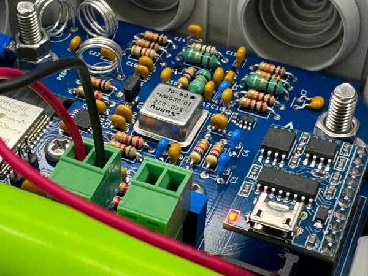

# iPieper: Uitgebreide 2m FM vossenjacht zender

De iPieper is een laagvermogen PLL gestuurde FM-vossenjachtzender met WAV/MP3 geheugen. Ook kun je
verschillende instellingen programmeren, zoals hoe lang de zender ingeschakeld of uitgeschakeld moet zijn, welk
bestand moet worden afgespeeld en op welke frequentie er moet worden uitgezonden. Je kunt elke willekeurige
frequentie tussen 144 en 146MHz gebruiken in een raster van 25kHz. Het is ook mogelijk om de iPieper zelf een
frequentie te laten kiezen wanneer deze begint met uitzenden.

Ook is er een header aanwezig met een aantal GPIOs. Zo kun je bijvoorbeeld zelf sensoren aansluiten. De software en
hardware is geheel opensource dus naar gelieve aan te passen.

Programmeren gaat via het Bluetooth serial protocol. Wanneer de iPieper met bijvoorbeeld een Windows laptop via
bluetooth is verbonden zal er een virtuele COM-poort beschikbaar komen om deze te programmeren.

